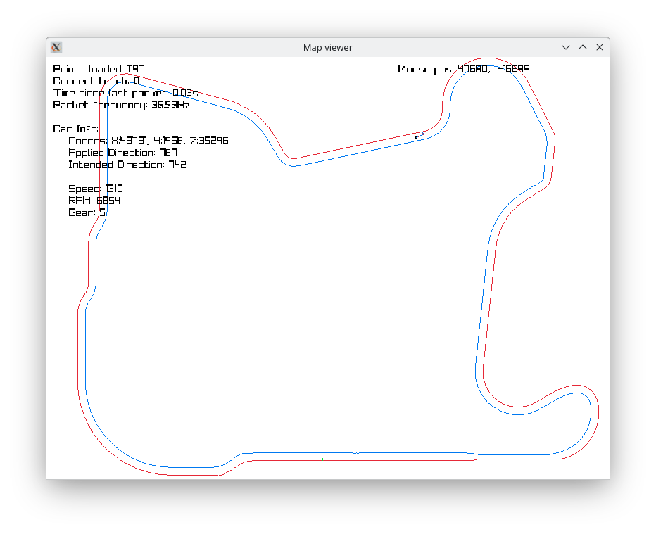

# R4-RL
A project to make a AI agent to race in Ridge Racer Type 4.

## Objective
To make an AI agent that can navigate, drive fast and potentially discover strategies and make lap records on Namco® R4: Ridge Racer Type 4™

## How to run
### Memory observers and track mapper client (in PCSX-Redux)
The project expects that the PCSX-Redux executable is located and launched from the project's root directory.

When opening PCSX-Redux, the pcsx.lua file on the root directory should load automatically, loading the rest of the modules and showing a "R4" window with all the info.

After loading a Ridge Racer Type 4 copy (not provided), navigate to the Time Attack section and load a track. The information shown on the R4 window will be correct then.

For the track mapper client to start sending data, the "Capture Track" checkbox under the "Track capture" tab must be enabled. This client will not check if the server has received the datagrams, so you must make sure that the server is running beforehand.

### Track mapper server
This is located under the "python" directory.

First you must create a virtual environment and activate it. Then install the dependencies with `pip install -r requirements.txt` and run the `harvest_track.py` program.

The collected data will be saved in a `track_data.db` sqlite file.

### Map viewer
In the same folder as the track mapper server, activate the virtual enviroment and run the `map_viewer.py` program.

#### Controls
- Mouse left click: Draw view.
- Mouse scrool wheel: Zoom in/out.
- Q/W: Change to the previous/next track.

## TODO List
- Data collection
    - [x] Find and monitor relevant memory addresses to read
        - [ ] Finding competitor's data in memory could allow for the AI Agent to participate in Grand Prix mode
    - [x] Sample track walls
        - This will allow us to make a simpler model by not needing visual input later
- Wall distance detector
    - [ ] Build a simulated enviroment to cast rays to the track walls previously collected.
- AI Agent
    - [ ] Choose model (Probably NEAT)
    - [ ] Connect the model to PCSX-Redux
    - [ ] Train and adjust hyperparameters
    - [ ] Draw the model's output to PCSX-Redux screen using NanoVG