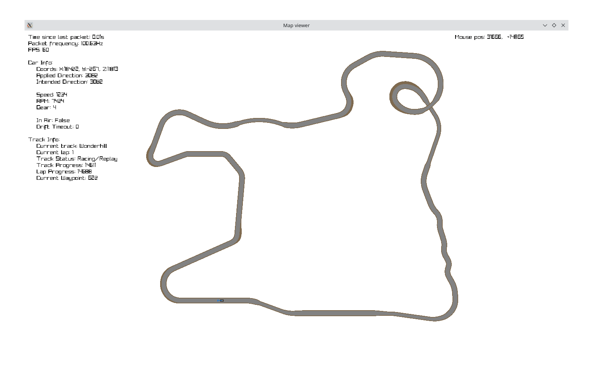
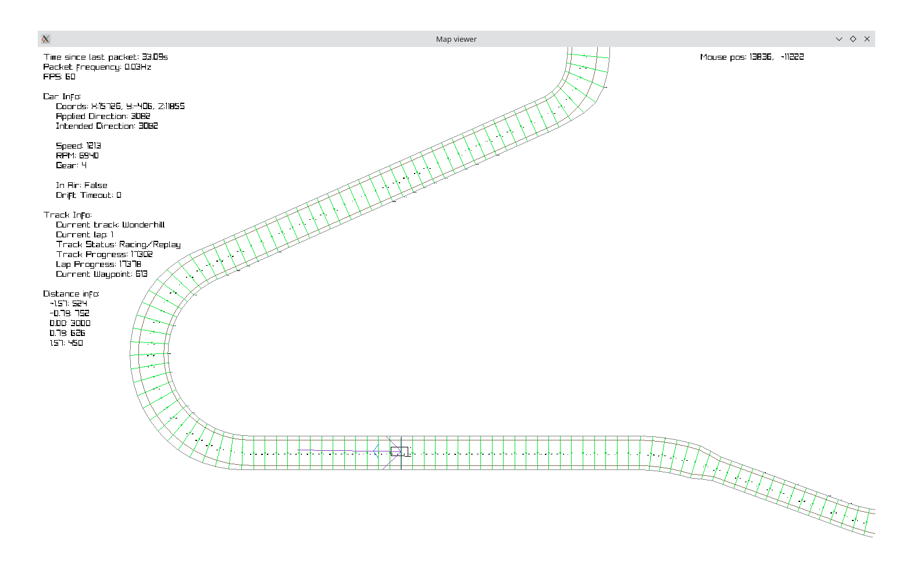
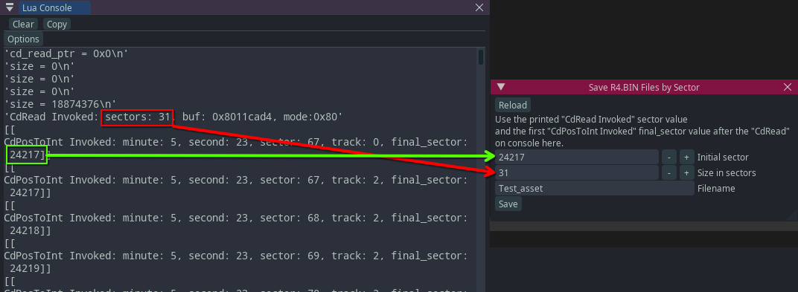

# R4-RL
A project to make a AI agent to race in Ridge Racer Type 4.

## Objective
To make an AI agent that can navigate, drive fast and potentially discover strategies and make lap records on Namco® R4: Ridge Racer Type 4™

## How to run
### Memory observers and file extractor (in PCSX-Redux)
The project expects that the PCSX-Redux executable is located and launched from the project's root directory.

When opening PCSX-Redux, the pcsx.lua file on the root directory should load automatically, loading the rest of the modules and showing a "R4" window with all the game info, plus a check.

For the first time only, once you load the game in PCSX-Redux, extract the `R4.BIN` file pressing the "Save R4.BIN" button on the "Save R4.BIN Files" window.

### Track info extractor
This is located under the "python" directory.

After extracting the `R4.BIN` file, just run this script with `python extract_tracks.py`

### Map viewer
In the same folder as the track info extractor, activate the virtual enviroment and run the `map_viewer.py` program.

| Normal view | Debug view | 
 :------: | :-------: 
|  |  |

#### Controls
- Mouse left click: Draw view.
- Mouse scrool wheel: Zoom in/out.
- Z: Chase car.
- X: Rotate camera with car while chasing.
- C: Toggle distance rays
- V: Toggle between polygon track drawing or line/debug drawing mode.
- B: Toggle drawing only the waypoints visible to the ray colliders

### Sector-based asset extractor
On PCSX-Redux, there will be a menu called "Save R4.BIN Files". In the Size in sectors field you have to enter the `sectors` number given by the "CdRead Invoked" print in console, and in the Initial sector field you have to enter the `final_sector` number given by the  first "CdPosToInt Invoked" print after the "CdRead" one. You can enter a custom filename.

The saved file will be named `{initial_sector}-{final_sector}_{filename}.dmp` in the `extracted/` folder.

## TODO List
- Data collection
    - [x] Find and monitor relevant memory addresses to read
        - [ ] Finding competitor's data in memory could allow for the AI Agent to participate in Grand Prix mode
    - [x] Sample track walls
        - This will allow us to make a simpler model by not needing visual input later
- Wall distance detector
    - [X] Build a simulated enviroment to cast rays to the track walls previously collected.
- AI Agent
    - [ ] Choose model (Probably NEAT)
    - [ ] Connect the model to PCSX-Redux
    - [ ] Train and adjust hyperparameters
    - [ ] Draw the model's output to PCSX-Redux screen using NanoVG

# Credits
- Whitehole (@whiteh0le) for providing the tracks' waypoint offsets and struct, as well as the cars' bounding box, enabling to use accurate track data for the simulation.